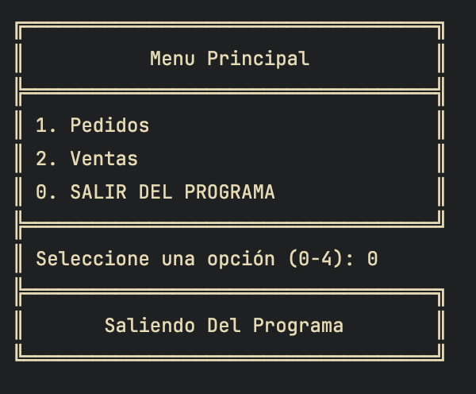

# Proyecto de Acceso a Datos: JDBC

Este proyecto fue realizado para la asignatura de accesoa  datos con el fin de aprender a usar el driver JDBC.

## Funciones

Si te registras con admin puedes modificar productos y proveedores, en todo caso siempre podrás realizar operaciones de venta y pedidos.

## Características

- Interfaz agradable y cuidada.
- Control de excepciones.
- Buen sistema de clases.

# Foto

